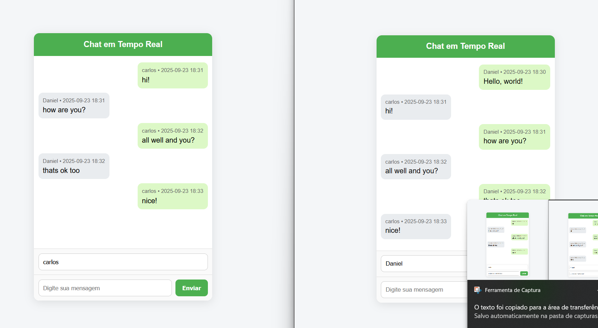

# 💬 Chat WebSocket com Spring Boot

Este é um projeto de chat em tempo real desenvolvido com **Java + Spring Boot**, utilizando **WebSocket** e **STOMP** para comunicação bidirecional entre clientes e servidor.

O objetivo é estudar e praticar os conceitos de WebSocket, mensageria em tempo real e integração com frontend via **SockJS + Stomp.js**.

---

## 🚀 Tecnologias utilizadas

- Java 17  
- Spring Boot 3  
- Spring WebSocket  
- STOMP (Simple Text Oriented Messaging Protocol)  
- SockJS + Stomp.js no frontend  
- HTML + CSS + JS para interface  

---

## ⚙️ Funcionalidades

- Envio e recebimento de mensagens em tempo real.  
- Exibição do nome do usuário, mensagem e hora do envio.  
- Diferenciação visual entre mensagens enviadas e recebidas.  
- Interface simples e intuitiva, estilo mensageria.  

---

## 📂 Estrutura do projeto

config/      → Configuração do WebSocket e STOMP.  
controller/  → Controlador para processar e distribuir mensagens.  
model/       → Modelo da mensagem (from, text, time).  
util/        → Utilitário para formatação de data/hora.  
resources/static/index.html → Frontend simples para testar o chat.  

---

## 🖼️ Demonstração

Duas abas do navegador podem se comunicar em tempo real:

Daniel • 2025-09-22 19:50  
Olá pessoal!

Maria • 2025-09-22 19:52  
Oi Daniel!

**Imagem de demonstração do chat:**   

---

## ▶️ Como executar

1. Clone o repositório:

git clone https://github.com/DanielSouzzz/chat-websocket-spring.git

2. Acesse a pasta e rode a aplicação:

./mvnw spring-boot:run

3. Abra no navegador:

http://localhost:8080/index.html
